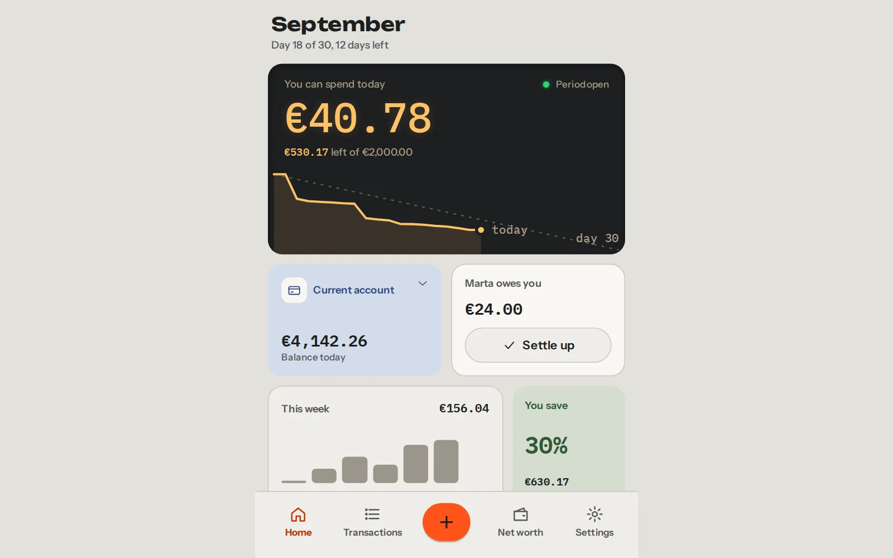
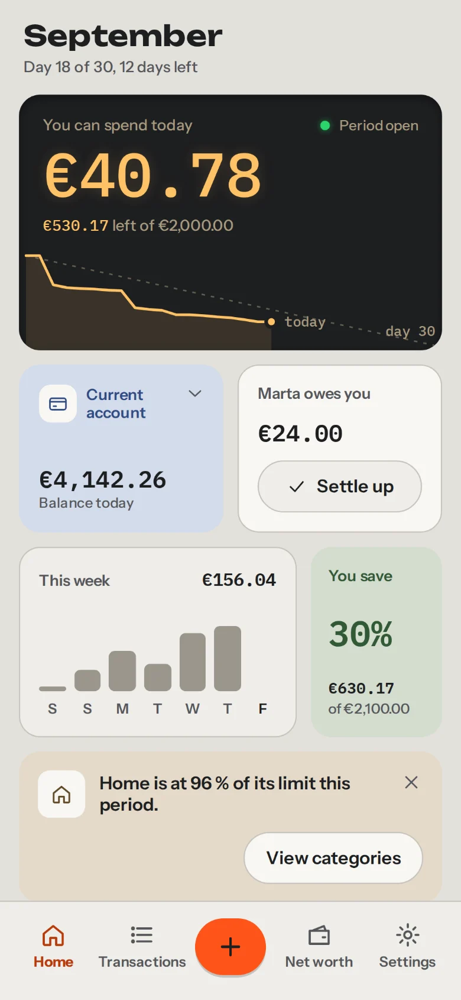
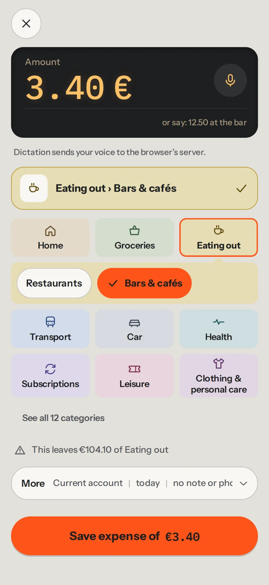
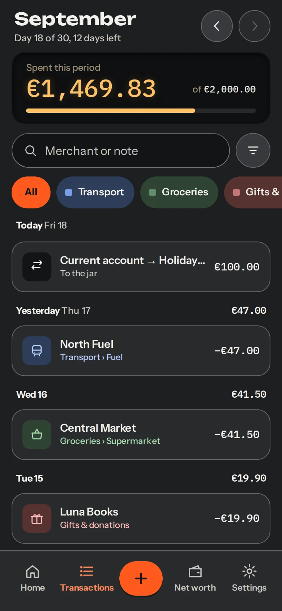
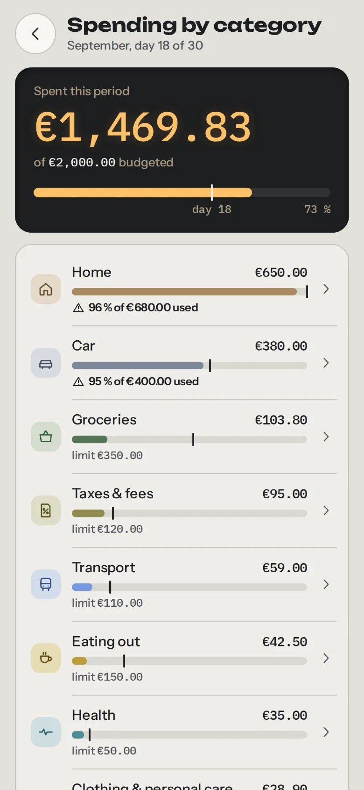
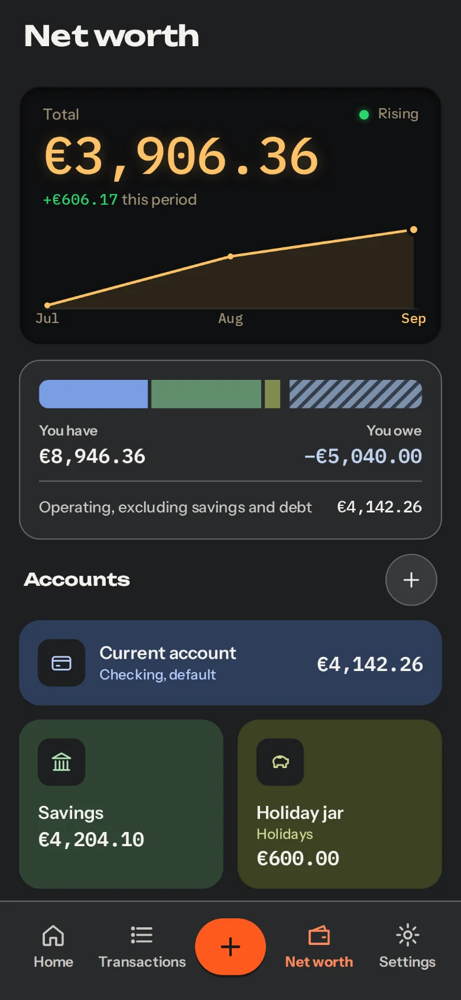
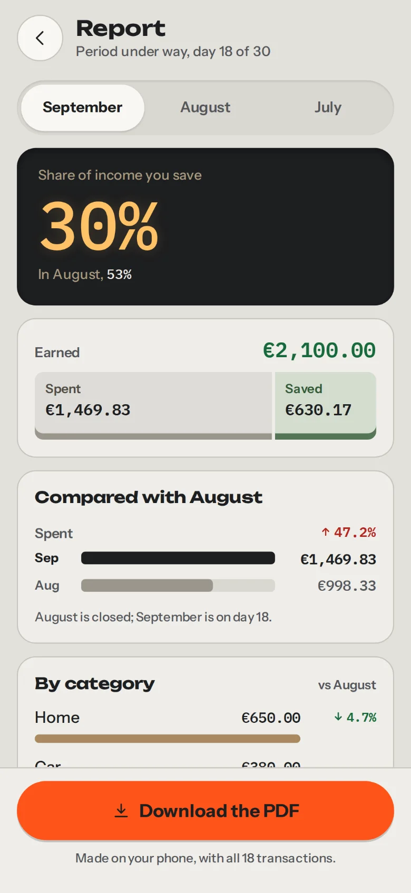

<div align="center">


# BaseCero

**Your money, from zero.**

Personal finance that lives entirely on your device, with no accounts and no cloud.<br>
For anyone who tracks their spending by hand and wants to stay the owner of their data.

[Español](README.md) · **English**

<a href="https://basecero.alvarotc.com/app/"></a>

[Project website](https://basecero.alvarotc.com/en/) · [Install](#installation)

<a href="https://github.com/alvarotorresc/basecero/releases/latest"></a>
<a href="https://github.com/alvarotorresc/basecero/actions/workflows/ci.yml"></a>
<a href="LICENSE"></a>

</div>



## What it is

BaseCero orders your money into periods, payday to payday, and tells you at any moment what is
actually left. It is for anyone who tracks their spending by hand, wants to see where the month
went, and would rather their accounts didn't live on somebody else's server. It opens in your
browser, installs like an app, and works offline.

**No accounts · no server · no cloud · no telemetry.**

## What it does

- **Your month starts the day you get paid.** Payday-to-payday periods, not the 1st to the 30th.
  Close one and you see what you spent, what you saved, and your savings rate for the stretch.
- **Logging, fast.** One screen: the amount on the phone keypad and the category from a grid of
  tiles, each in its own colour. You can also type or dictate "12.50 at the bar with Marta" and
  the app pulls the amount, the shop and who you split it with out of the sentence. Five kinds of entry:
  expense, income, transfer, refund and adjustment.
- **Spending by category.** All your categories, sorted by what you have spent so far, each with
  its bar and its percentage. Each one expands into its subcategories. You set a limit only
  where it helps, and change or remove it right there. Home tells you whether you are above or
  below the pace of the plan.
- **Categories that are yours.** You start with 41 across two levels and change the name,
  colour, icon and order. The ones you don't need get archived without touching your history.
- **Shared expenses, both ways.** You log who paid and which share is yours. If the other person
  paid, the expense counts as yours but doesn't touch your accounts until you settle up.
  "Settle up" shows both debts and the net figure, and closes them in one go. Expenses get
  split; income belongs to whoever earns it.
- **Recurring entries and forecasting.** Rules for the rent, subscriptions or your salary. With
  them, Home works out what is still committed and what is really available.
- **Net worth.** Your net worth today and how it has moved, current and savings accounts, debts
  with their instalment and how many are left, and savings goals with their own pot.
- **Period report.** What came in, what went out and what you saved, against the previous period
  and by category. You download it as a PDF, and the PDF is generated on your phone.
- **Import your bank statement.** N26 CSVs are recognised on their own; for any other bank an
  assistant asks once what each column is. It reconciles what you already logged and skips
  duplicates.
- **In Spanish and in English,** with the currency and the number and date formats you pick.

And the small things: a configurable payday, combined filters in Transactions, a review step
before importing, duplicating a transaction, moving money into a goal's pot, a page for every
account and goal, and unticking categories when you start.

## What it looks like

The background is aluminium grey in the light theme and graphite in the dark one; you pick
either, or follow your system. Colour comes from the category: each one has its family (Sage,
Mustard, Sky… twelve in all) and carries it everywhere, in the tint of its tile, in its bar and in
its figure. Orange is kept for the main action, and the figure that matters shows in amber on a
dark panel, like a calculator's.

| Home | Log transaction | Transactions |
| :--: | :-------------: | :----------: |
|  |  |  |
| **Spending by category** | **Net worth** | **Report** |
|  |  |  |

## Installation

There is no store and nothing to download: your browser keeps BaseCero as an application, with
its own icon and full screen. Open
**[basecero.alvarotc.com/app/](https://basecero.alvarotc.com/app/)** and:

| Platform | How |
| --- | --- |
| **Android / Chrome** | Menu (⋮) → "Add to Home screen", or the browser's own install prompt. |
| **iPhone / Safari** | Share button → "Add to Home Screen". It has to be Safari: iOS doesn't allow installing web apps from other browsers. |
| **Desktop / Chrome, Edge** | The install icon in the address bar, or menu → "Install BaseCero…". |

Once installed it works offline, and to uninstall it you just delete the icon.

## Your data, in your hands

- **No accounts and no server.** No sign-up, no login, no backend. Nothing to leak, because
  there is nothing on the other side.
- **No telemetry, no analytics, no cookies.** The app measures nothing and reports to nobody, so
  there is no banner to consent to either.
- **No third-party requests.** Everything it needs travels inside the repository: it works with
  the network unplugged. There are two ways out, and you open both: the link to the feedback
  form, which opens outside the app and carries only what you type into it, and dictation in Log
  transaction (more on that below).
- **Your data never leaves the device.** It lives in a local database in the browser and only
  moves if you export it.
- **And if you leave, you take it with you.** You export an `.xlsx` spreadsheet you can open in
  LibreOffice or Google Sheets, and password-encrypted backups to keep wherever you want.

One honest caveat: what is encrypted are the backups, not the local database. That one lives in
the browser's private storage and is protected by the device itself, so whoever holds your
unlocked phone holds your accounts. And since you keep the keys, there is no "forgot my
password": make backups.

Another caveat: dictation is not local. If you tap the mic in Log transaction, speech
recognition is done by the browser, and the browser sends your voice to its vendor's server. The
app says so under the text box. If you'd rather it didn't, type the sentence instead of saying
it: typed text is parsed on your device.

<details>
<summary><b>Technical details</b></summary>

### How it's built

Vanilla JS. The app has no framework, no bundler and no `node_modules`: the code you read is the
code that runs in the browser.

- **Data.** SQLite compiled to WebAssembly, in a Web Worker over OPFS (the origin's private
  storage). If the browser doesn't support it, the app says so and starts in memory.
- **Offline.** A service worker with an explicit precache of the whole shell, including
  SQLite's `.wasm` and the typefaces.
- **Themes.** Colours come from CSS tokens defined in pairs, light and dark. The twelve category
  families are stored as data (one key per category, not a loose colour) and the CSS paints them
  in each theme.

### Export and import

- **`.xlsx`.** The full data contract: accounts, categories, periods, transactions, recurring
  rules, goals and budgets. It can be re-imported to replace the data, and a round-trip test
  checks that exporting and re-importing leaves it intact, relationships included.
- **`.bce`.** A backup encrypted with AES-256-GCM and a key derived with PBKDF2-HMAC-SHA256 at
  600,000 iterations, with a 10-character minimum password. It is stored nowhere: if you forget
  it, the backup is unrecoverable.
- **`.json`.** A quick emergency dump from Settings.

### Tests and development

More than 1500 tests with Node's native runner, no dependencies. The pure logic (forecasting,
charts, formatting, CSV and sentence parsing, backup crypto, the `.xlsx` contract) lives apart
from the database and the DOM precisely so it can be tested that way.
[`.github/workflows/ci.yml`](.github/workflows/ci.yml) runs them on every push to `main` and
every PR.

```sh
python3 -m http.server 8000 -d app      # the landing on :8000, the app on :8000/app/
node --test tests/app/*.test.mjs        # the tests
```

> Use the glob, not `node --test tests/app`: the directory form is broken in Node 22.22.

### Layout

- [`app/`](app/): the published root of the site: ES/EN landing, legal pages and static files.
- [`app/app/`](app/app/): the whole PWA, with `js/screens/` (one screen per file), `js/i18n/`
  (es/en) and `vendor/`.
- [`tests/app/`](tests/app/): the suite, one file per logic module.

### Known limitations

- **A transfer imported from a CSV can end up duplicated.** The statement carries the transfer’s
  charge as one more line, so it shows up as an uncategorised expense on top of the transfer entry
  you already had. It is not reconciled automatically: drop it in the review step before
  importing, or delete the duplicate afterwards.
- **Income is not split with the other person.** The period’s percentage applies to shared
  expenses; income belongs, in full, to whoever earns it.

### History

BaseCero started life as a Google Sheets spreadsheet with a Python generator and an Apps Script
script. The app replaced all three, and neither program is in the repository any more: all that
survives from those days is the data contract (the same one the `.xlsx` exports and imports
today) and the pure import logic in [`app/app/vendor/pure.js`](app/app/vendor/pure.js), still written in
the Apps Script dialect it was born in.

</details>

## License

MIT, see [`LICENSE`](LICENSE). It bundles third-party software in
[`app/app/vendor/`](app/app/vendor/); the full notices are in
[`THIRD_PARTY_NOTICES.md`](THIRD_PARTY_NOTICES.md):

- [SheetJS](https://sheetjs.com/) (`xlsx.full.min.js`): Apache-2.0.
- [pdf-lib](https://pdf-lib.js.org/) (`pdf-lib.min.js`), for the Report PDF: MIT. Its bundle
  includes `tslib`, under Apache-2.0.
- [SQLite WASM](https://sqlite.org/wasm): SQLite is public domain; the Emscripten glue code is
  MIT / University of Illinois-NCSA.
- [Unbounded](https://github.com/googlefonts/unbounded),
  [Instrument Sans](https://github.com/Instrument/instrument-sans) and
  [IBM Plex Mono](https://github.com/IBM/plex): SIL Open Font License 1.1.
- Six icons from [Lucide](https://lucide.dev): ISC.

## Author

Made by [Álvaro Torres](https://github.com/alvarotorresc).

---

<div align="center">

[Website](https://basecero.alvarotc.com/en/) · [Open the app](https://basecero.alvarotc.com/app/) · [License](LICENSE) · [Report a problem](https://tally.so/r/PdJa6B)

</div>
