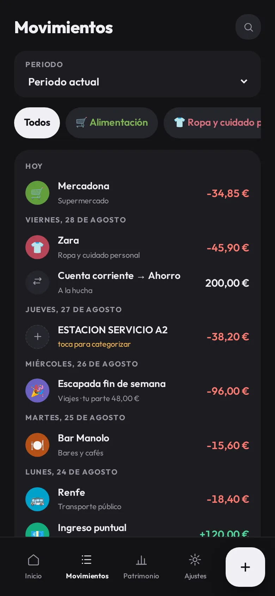

<div align="center">


# BaseCero

**Tu dinero, desde cero.**

App de finanzas personales que vive entera en tu dispositivo: sin cuentas, sin servidor, sin nube.<br>
Para quien lleva sus gastos a mano y quiere seguir siendo dueño de sus datos.

<a href="https://basecero.alvarotc.com/app/"><b>Abrir la app →</b></a>
&nbsp;·&nbsp;
<a href="https://basecero.alvarotc.com/">Web del proyecto</a>
&nbsp;·&nbsp;
<a href="https://basecero.alvarotc.com/en/">English</a>

<a href="https://github.com/alvarotorresc/basecero/actions/workflows/ci.yml"></a>
<a href="LICENSE"></a>

</div>

| Inicio | Movimientos | Patrimonio | Presupuesto |
| :----: | :---------: | :--------: | :---------: |
|  |  |  |  |

---

## Qué hace

**Tu mes empieza cuando cobras.** BaseCero organiza el dinero en *periodos* de nómina a nómina,
no del 1 al 30. Abres uno el día que entra el sueldo y lo cierras cuando llega el siguiente; al
cerrarlo ves lo gastado, lo ahorrado y tu tasa de ahorro del tramo.

**Registrar, rápido.** Importe con el teclado del móvil y todo en una sola pantalla. Cinco tipos
de apunte: gasto, ingreso, transferencia entre cuentas, devolución —enlazada al gasto que
reembolsa— y ajuste.

**Presupuesto por categoría y periodo.** Pones límite solo donde te sirve. La pantalla de
inicio te dice si vas por encima o por debajo del ritmo del plan, y cuánto te queda de verdad.

**Categorías tuyas.** Arrancas con un pack de 41 (Casa, Alimentación, Transporte…) en dos
niveles. Cambias nombre, color —de una paleta de 12 legible con daltonismo—, icono y orden;
marcas cada una como necesaria, prescindible o ahorro; y archivas las que sobren sin tocar el
historial.

**Gastos compartidos, sin discusiones.** Dices con quién compartes y el reparto por defecto del
periodo; en cada gasto lo ajustas si hace falta, de 5 en 5, y apuntas quién lo pagó: si lo pagó
la otra persona, el gasto cuenta como tuyo en su categoría pero no toca ninguna de tus cuentas
hasta que liquidas. La pantalla «Liquidar» enseña las dos deudas y el neto, y las cierra de golpe.
Si no compartes con nadie, esa parte de la app ni aparece.

**Recurrentes y previsión.** Reglas semanales, mensuales, trimestrales o anuales para alquiler,
suscripciones o la nómina. Con ellas el inicio calcula lo comprometido que queda por pagar y tu
*disponible real*.

**Patrimonio.** Patrimonio neto a día de hoy y su evolución, cuentas corrientes, de ahorro y
pasivos (con cuota mensual y cuántas quedan), y objetivos: fondo de emergencia, ahorro con
objetivo, provisión, techo de gasto y tasa de ahorro.

**Importar el extracto del banco.** Los CSV de N26 se reconocen solos; para cualquier otro banco
un asistente te pregunta una vez qué es cada columna —detecta formato de fecha y decimales, y te
enseña la vista previa— y guarda el perfil en tu dispositivo. Al importar, crea lo que falta,
concilia lo que ya habías apuntado a mano (mismo importe y sentido, ±3 días) y se salta los
duplicados. Aquí no se conecta ningún banco: tú apuntas o importas su CSV.

**En español y en inglés**, con la moneda y el formato de números y fechas que elijas.

## Privacidad: no es una promesa, es la arquitectura

- **Sin cuentas y sin servidor.** No hay registro, no hay login, no hay backend. Nada que filtrar
  porque no hay nada al otro lado.
- **Cero telemetría, cero analytics, cero cookies.** La app no mide nada ni informa a nadie.
- **Cero peticiones a terceros.** SQLite, SheetJS y la tipografía viajan dentro del repositorio;
  la app funciona con la red desconectada. La única salida al exterior es el enlace al formulario
  de incidencias, que se abre fuera de la app y solo lleva lo que escribas ahí.
- **Tus datos no salen del dispositivo.** Viven en una base SQLite local, sobre el OPFS del
  navegador, y solo se mueven si tú los exportas.
- **Y si te vas, te los llevas.** El formato de exportación es un `.xlsx` legible, no un rehén.

Un matiz honesto: el cifrado es de las copias `.bce`, no de la base local. La base vive en el
almacenamiento privado del navegador, protegida por el propio dispositivo — si alguien tiene tu
móvil desbloqueado, tiene tus cuentas. Como pierdes tú las llaves, tampoco hay «recuperar
contraseña»: haz copias.

## Instalación

BaseCero se instala como PWA desde el navegador; no hay tienda de aplicaciones de por medio.
Abre **[basecero.alvarotc.com/app/](https://basecero.alvarotc.com/app/)** y:

| Plataforma | Cómo |
| --- | --- |
| **Android / Chrome** | Menú (⋮) → «Añadir a pantalla de inicio», o el banner de instalación del propio navegador. |
| **iPhone / Safari** | Botón Compartir → «Añadir a pantalla de inicio». Solo desde Safari: el resto de navegadores de iOS no ofrecen la opción. |
| **Escritorio / Chrome, Edge** | Icono de instalación en la barra de direcciones, o menú → «Instalar BaseCero…». |

Una vez instalada funciona sin conexión: el service worker precachea la app entera y los datos
ya están en el dispositivo.

## Tus datos, en tus manos

- **Hoja de cálculo (`.xlsx`)** — exporta el contrato de datos completo (cuentas, categorías,
  periodos, movimientos, recurrentes, objetivos y presupuestos) y ábrelo en LibreOffice o Google
  Sheets. Se puede reimportar para reemplazar los datos de la app; hay un test de round-trip que
  comprueba que exportar y reimportar deja los datos y sus relaciones intactos.
- **Copia cifrada (`.bce`)** — AES-256-GCM con clave derivada por PBKDF2-HMAC-SHA256 a 600.000
  iteraciones, contraseña de 10 caracteres como mínimo. La contraseña no se guarda en ningún
  sitio: si la olvidas, la copia es irrecuperable.
- **Copia de emergencia (`.json`)** — un volcado rápido desde Ajustes.

## Bajo el capó

Vanilla JS. Sin framework, sin bundler, sin `node_modules`: el código que lees es el que se
ejecuta en el navegador.

- **Datos** — SQLite compilado a WebAssembly, corriendo en un Web Worker sobre OPFS (el
  almacenamiento privado del origen). Si el navegador no lo soporta, la app avisa y arranca en
  memoria; y si ya la tienes abierta en otra pestaña, la segunda te avisa de que ahí no se
  guardará nada.
- **Offline** — service worker con precache explícito del *shell* completo, incluidos el `.wasm`
  de SQLite y la tipografía.
- **Estructura** — `app/` es la raíz publicada del sitio: landing ES/EN, legales y estáticos. La
  PWA entera vive en [`app/app/`](app/app/), con `js/screens/` (una pantalla por fichero),
  `js/i18n/` (es/en) y `vendor/`.
- **Tests** — unos 400 tests con el runner nativo de Node, sin dependencias. La lógica pura
  (previsión, gráficas, formato, parseo de CSV, cripto de backups, contrato `.xlsx`) está
  aislada de la base de datos y del DOM precisamente para poder probarla así. Los corre
  [`.github/workflows/ci.yml`](.github/workflows/ci.yml) en cada push a `main` y en cada PR.

### Levantarlo en local

Hace falta un servidor estático: la app usa módulos ES y un service worker, y ninguno de los dos
funciona sobre `file://`. Desde la raíz del repositorio:

```sh
python3 -m http.server 8000 -d app
```

Y abre <http://localhost:8000/> (la landing) o <http://localhost:8000/app/> (la app).

Los tests, también desde la raíz:

```sh
node --test tests/app/*.test.mjs
```

> Usa el glob, no `node --test tests/app`: la forma de directorio está rota en Node 22.22.

## Historia

BaseCero empezó siendo una hoja de Google Sheets, con un generador en Python y un script de Apps
Script que le daban autorrelleno e import de CSV. La app sustituyó a ambos y los dos se retiraron
del repositorio; siguen en el historial de git (`git show dae6b77^:generator/…` y
`git show 76bfdfb^:apps_script/main.js`, con un clon de historia completa).

## Licencia

MIT — ver [`LICENSE`](LICENSE).

Incluye software de terceros en [`app/app/vendor/`](app/app/vendor/):

- [SheetJS](https://sheetjs.com/) (`xlsx.full.min.js`) — Apache-2.0.
- [SQLite WASM](https://sqlite.org/wasm) — SQLite es de dominio público; el *glue code* de
  Emscripten es MIT / University of Illinois-NCSA.
- [Outfit](https://fonts.google.com/specimen/Outfit) — SIL Open Font License 1.1.
