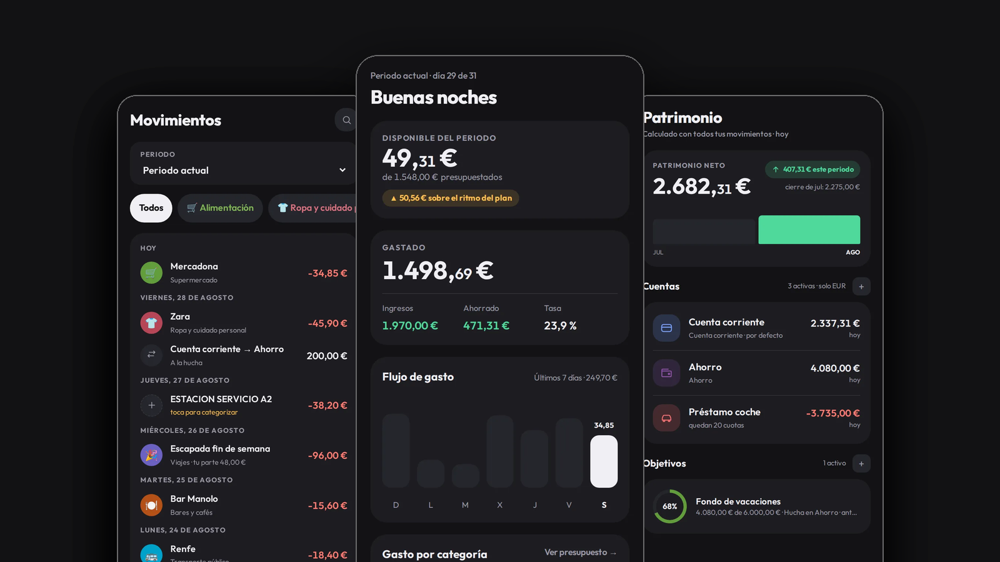
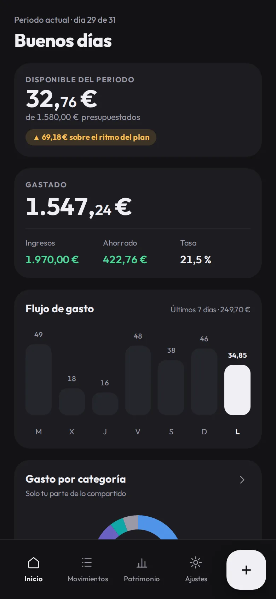
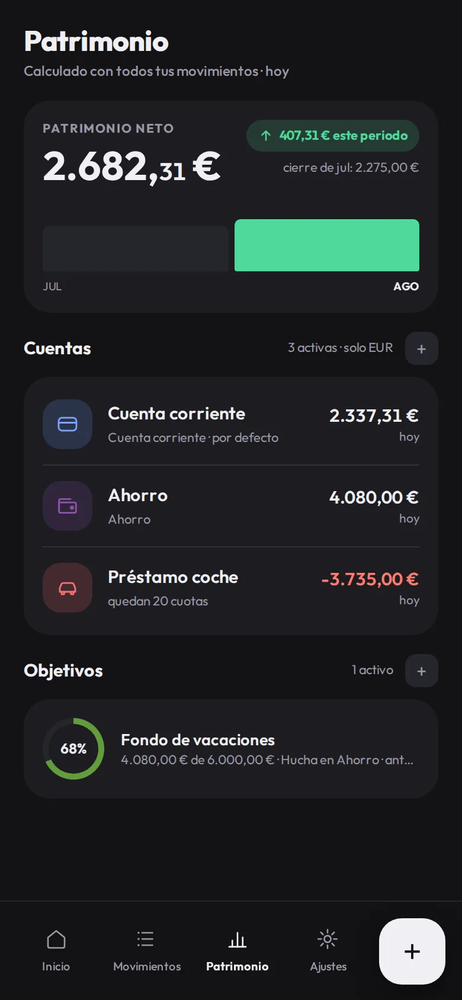
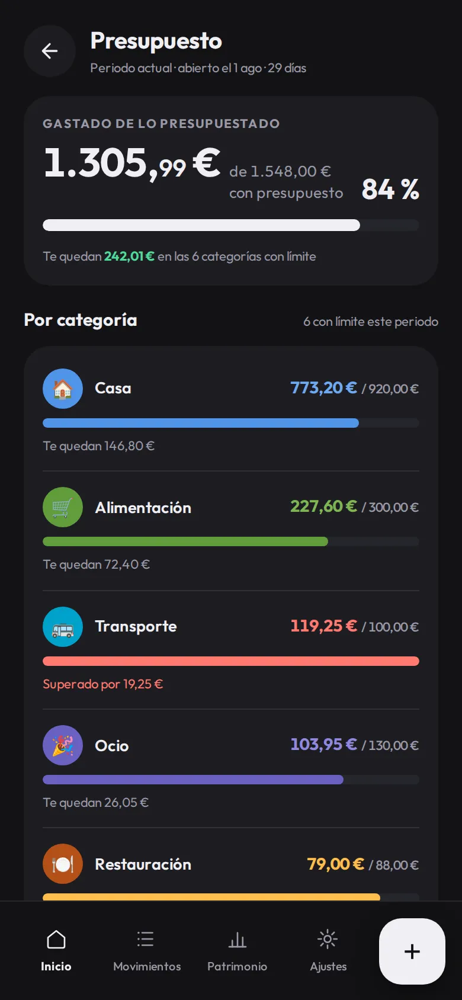

<div align="center">


# BaseCero

**Tu dinero, desde cero.**

App de finanzas personales que vive entera en tu dispositivo, sin cuentas y sin nube.<br>
Para quien lleva sus gastos a mano y quiere seguir siendo dueño de sus datos.

**Español** · [English](README.en.md)

<a href="https://basecero.alvarotc.com/app/"></a>

[Web del proyecto](https://basecero.alvarotc.com/) · [Instalar](#instalación)

<a href="https://github.com/alvarotorresc/basecero/releases/latest"></a>
<a href="https://github.com/alvarotorresc/basecero/actions/workflows/ci.yml"></a>
<a href="LICENSE"></a>

</div>



## Qué es

BaseCero ordena tu dinero por periodos de nómina a nómina y te dice, en cada momento, cuánto te
queda de verdad. Es para quien lleva sus gastos a mano, quiere ver en qué se le va el mes y
prefiere que sus cuentas no vivan en el servidor de nadie. Se abre en el navegador, se instala
como una app y funciona sin conexión.

**Sin cuentas · sin servidor · sin nube · sin telemetría.**

## Qué hace

- **Tu mes empieza cuando cobras.** Periodos de nómina a nómina, no del 1 al 30. Al cerrar uno
  ves lo gastado, lo ahorrado y tu tasa de ahorro del tramo.
- **Registrar, rápido.** Todo en una pantalla, con el teclado del móvil para el importe. Cinco
  tipos de apunte: gasto, ingreso, transferencia, devolución y ajuste.
- **Gasto por categoría.** Una pantalla con todas tus categorías, ordenadas por lo que llevas
  gastado, que se despliegan para ver el detalle por subcategoría. Pones límite solo donde te
  sirve, y desde ahí mismo lo cambias o lo quitas. La pantalla de inicio te dice si vas por
  encima o por debajo del ritmo del plan.
- **Categorías tuyas.** Arrancas con 41 en dos niveles y cambias nombre, color, icono y orden.
  Las que sobran se archivan sin tocar el historial.
- **Gastos compartidos en las dos direcciones.** Apuntas quién pagó y qué parte es tuya. Si pagó
  la otra persona, el gasto cuenta como tuyo pero no toca tus cuentas hasta liquidar; «Liquidar»
  enseña las dos deudas, el neto, y las cierra de golpe. Se reparten los gastos: los ingresos son
  de quien los cobra.
- **Recurrentes y previsión.** Reglas para el alquiler, las suscripciones o la nómina. Con ellas
  el inicio calcula lo comprometido que queda por pagar y tu disponible real.
- **Patrimonio.** Tu neto a día de hoy y su evolución, cuentas corrientes y de ahorro, pasivos
  con su cuota y las que quedan, y objetivos de ahorro.
- **Importar el extracto del banco.** Los CSV de N26 se reconocen solos; para el resto, un
  asistente pregunta una vez qué es cada columna. Concilia lo ya apuntado y se salta duplicados.
- **En español y en inglés,** con la moneda y el formato de números y fechas que elijas.

## Cómo se ve

| Inicio | Movimientos | Patrimonio | Gasto por categoría |
| :----: | :---------: | :--------: | :---------: |
|  |  |  |  |

## Instalación

No hay tienda ni descarga: el navegador guarda BaseCero como una aplicación, con su icono y su
pantalla completa. Abre **[basecero.alvarotc.com/app/](https://basecero.alvarotc.com/app/)** y:

| Plataforma | Cómo |
| --- | --- |
| **Android / Chrome** | Menú (⋮) → «Añadir a pantalla de inicio», o el banner de instalación del propio navegador. |
| **iPhone / Safari** | Botón Compartir → «Añadir a pantalla de inicio». Tiene que ser Safari: iOS no deja instalar aplicaciones web desde otros navegadores. |
| **Escritorio / Chrome, Edge** | Icono de instalar en la barra de direcciones, o menú → «Instalar BaseCero…». |

Una vez instalada funciona sin conexión, y para desinstalarla basta con borrar el icono.

## Tus datos, en tus manos

- **Sin cuentas y sin servidor.** No hay registro, no hay login, no hay backend. Nada que
  filtrar, porque no hay nada al otro lado.
- **Cero telemetría, cero analytics, cero cookies.** La app no mide nada ni informa a nadie, y
  por eso tampoco hay banner que aceptar.
- **Cero peticiones a terceros.** Todo lo que necesita viaja dentro del repositorio: funciona
  con la red desconectada. La única salida al exterior es el enlace al formulario de
  incidencias, que se abre fuera de la app y solo lleva lo que escribas ahí.
- **Tus datos no salen del dispositivo.** Viven en una base de datos local del navegador y solo
  se mueven si tú los exportas.
- **Y si te vas, te los llevas.** Exportas una hoja de cálculo `.xlsx` que abres en LibreOffice
  o en Google Sheets, y copias cifradas con contraseña para guardar donde tú digas.

Un matiz honesto: lo cifrado son las copias, no la base local. Esa vive en el almacenamiento
privado del navegador y la protege el propio dispositivo, así que quien tenga tu móvil
desbloqueado tiene tus cuentas. Y como las llaves las tienes tú, no hay «recuperar contraseña»:
haz copias.

<details>
<summary><b>Detalles técnicos</b></summary>

### Cómo está hecha

Vanilla JS. Sin framework, sin bundler y sin `node_modules`: el código que lees es el que se
ejecuta en el navegador.

- **Datos** — SQLite compilado a WebAssembly, en un Web Worker sobre OPFS (el almacenamiento
  privado del origen). Si el navegador no lo soporta, la app avisa y arranca en memoria.
- **Offline** — service worker con precache explícito del *shell* entero, incluidos el `.wasm`
  de SQLite y la tipografía.

### Exportar e importar

- **`.xlsx`** — el contrato de datos completo: cuentas, categorías, periodos, movimientos,
  recurrentes, objetivos y presupuestos. Se puede reimportar para reemplazar los datos, y un
  test de round-trip comprueba que exportar y reimportar los deja intactos con sus relaciones.
- **`.bce`** — copia cifrada con AES-256-GCM y clave derivada por PBKDF2-HMAC-SHA256 a 600.000
  iteraciones, con contraseña de 10 caracteres como mínimo. No se guarda en ningún sitio: si la
  olvidas, la copia es irrecuperable.
- **`.json`** — un volcado rápido de emergencia desde Ajustes.

### Tests y desarrollo

Más de 450 tests con el runner nativo de Node, sin dependencias. La lógica pura —previsión,
gráficas, formato, parseo de CSV, cripto de las copias, contrato `.xlsx`— vive aislada de la base
de datos y del DOM precisamente para poder probarla así. Los corre
[`.github/workflows/ci.yml`](.github/workflows/ci.yml) en cada push a `main` y en cada PR.

```sh
python3 -m http.server 8000 -d app      # la landing en :8000, la app en :8000/app/
node --test tests/app/*.test.mjs        # los tests
```

> Usa el glob, no `node --test tests/app`: la forma de directorio está rota en Node 22.22.

### Estructura

- [`app/`](app/) — la raíz publicada del sitio: landing ES/EN, legales y estáticos.
- [`app/app/`](app/app/) — la PWA entera, con `js/screens/` (una pantalla por fichero),
  `js/i18n/` (es/en) y `vendor/`.
- [`tests/app/`](tests/app/) — la suite, un fichero por módulo de lógica.

### Límites conocidos

- **Una transferencia importada por CSV puede duplicarse.** El extracto trae el cargo de la
  transferencia como una línea más, así que entra como un gasto sin categoría además del apunte
  de transferencia que ya tuvieras. No se reconcilia sola: hay que borrar el duplicado a mano.
- **Los ingresos no se reparten con la contraparte.** El porcentaje del periodo se aplica a los
  gastos compartidos; un ingreso es de quien lo cobra, entero.

### Historia

BaseCero empezó siendo una hoja de Google Sheets con un generador en Python y un script de Apps
Script. La app sustituyó a los tres y esos dos programas ya no están en el repositorio: de aquella
época solo sobreviven el contrato de datos —el mismo que hoy exporta e importa el `.xlsx`— y la
lógica pura de import en [`app/app/vendor/pure.js`](app/app/vendor/pure.js), que se escribió con la
sintaxis de Apps Script y la conserva.

</details>

## Licencia

MIT — ver [`LICENSE`](LICENSE). Incluye software de terceros en
[`app/app/vendor/`](app/app/vendor/), con sus avisos completos en
[`THIRD_PARTY_NOTICES.md`](THIRD_PARTY_NOTICES.md):

- [SheetJS](https://sheetjs.com/) (`xlsx.full.min.js`) — Apache-2.0.
- [SQLite WASM](https://sqlite.org/wasm) — SQLite es de dominio público; el *glue code* de
  Emscripten es MIT / University of Illinois-NCSA.
- [Outfit](https://fonts.google.com/specimen/Outfit) — SIL Open Font License 1.1.

## Autor

Hecha por [Álvaro Torres](https://github.com/alvarotorresc).

---

<div align="center">

[Web](https://basecero.alvarotc.com/) · [Abrir la app](https://basecero.alvarotc.com/app/) · [Licencia](LICENSE) · [Reportar un problema](https://tally.so/r/PdJa6B)

</div>
