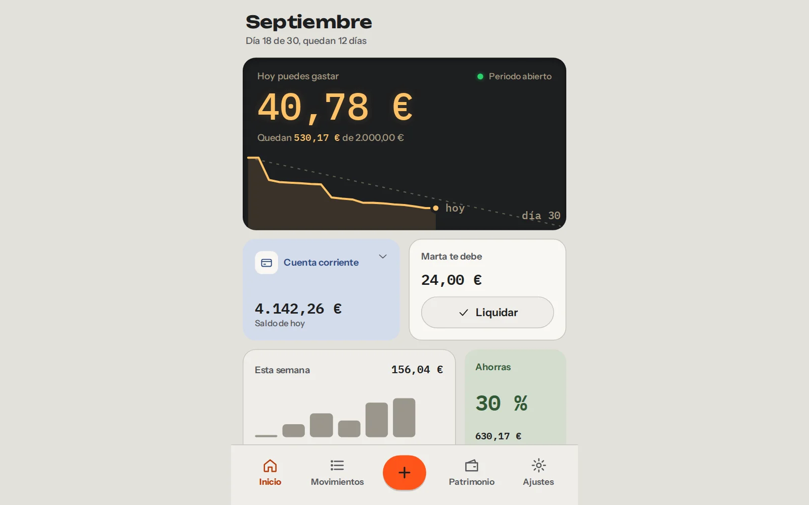
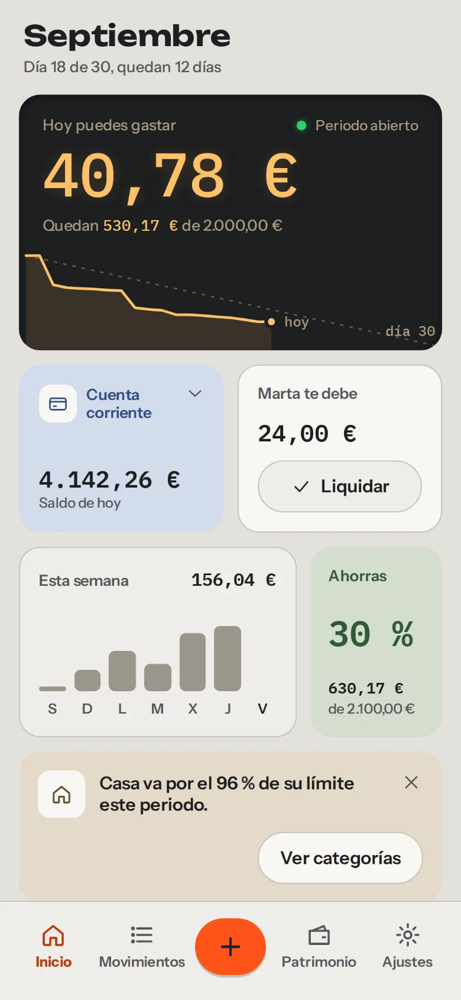
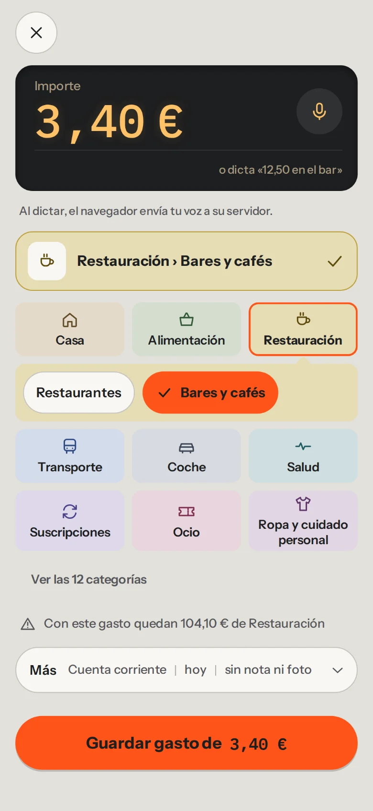
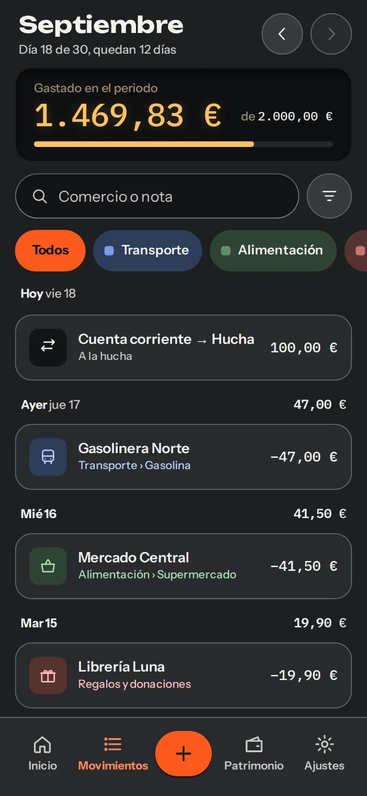
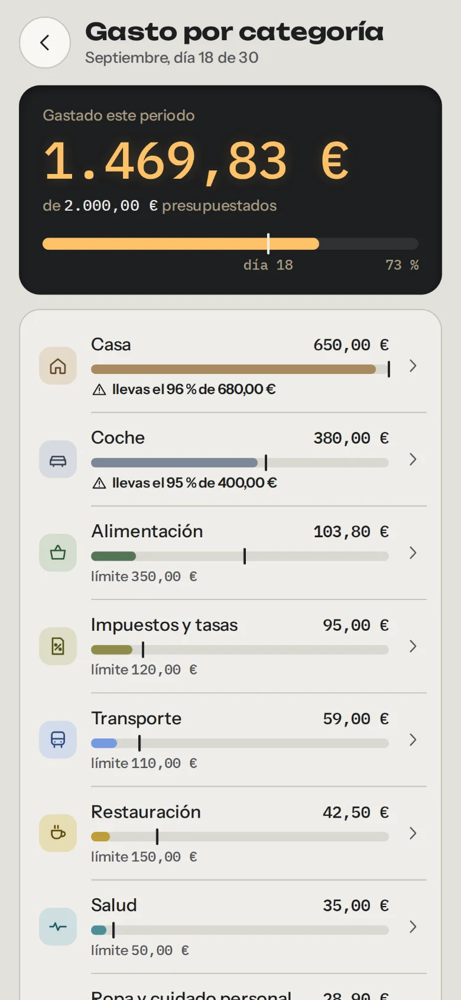
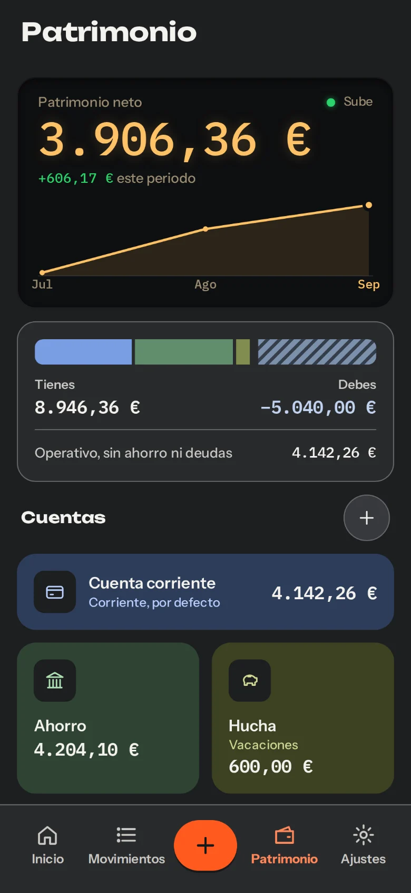
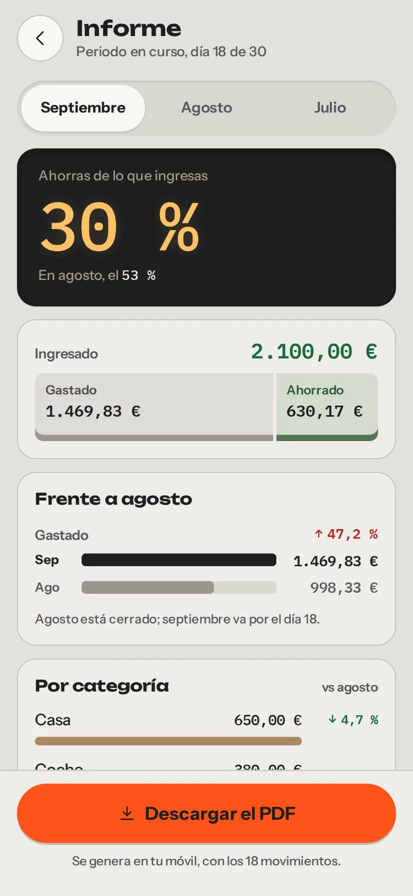

<div align="center">


# BaseCero

**Tu dinero, desde cero.**

App de finanzas personales que vive entera en tu dispositivo, sin cuentas y sin nube.<br>
Para quien lleva sus gastos a mano y quiere seguir siendo dueño de sus datos.

**Español** · [English](README.en.md)

<a href="https://basecero.alvarotc.com/app/"></a>

[Web del proyecto](https://basecero.alvarotc.com/) · [Instalar](#instalación)

<a href="https://github.com/alvarotorresc/basecero/releases/latest"></a>
<a href="https://github.com/alvarotorresc/basecero/actions/workflows/ci.yml"></a>
<a href="LICENSE"></a>

</div>



## Qué es

BaseCero ordena tu dinero por periodos, de nómina a nómina, y te dice en cada momento cuánto te
queda de verdad. Es para quien lleva sus gastos a mano, quiere ver en qué se le va el mes y
prefiere que sus cuentas no vivan en el servidor de nadie. Se abre en el navegador, se instala
como una app y funciona sin conexión.

**Sin cuentas · sin servidor · sin nube · sin telemetría.**

## Qué hace

- **Tu mes empieza cuando cobras.** El periodo va de nómina a nómina, o del día 1 si lo
  prefieres. Lo cierras tú, e Inicio te avisa el día que toca. Al cerrarlo ves lo gastado, lo
  ahorrado y tu tasa de ahorro del tramo.
- **Registrar, rápido.** Una sola pantalla: el importe con el teclado del móvil y la categoría en
  una rejilla de baldosas, cada una con su color. También puedes escribir o dictar «12,50 en el
  bar con Marta» y la app saca de la frase el importe, la categoría y el reparto. Cinco tipos de apunte: gasto, ingreso, transferencia,
  devolución y ajuste.
- **Gasto por categoría.** Todas tus categorías ordenadas por lo que llevas gastado, con su barra
  y su porcentaje. Cada una se despliega en subcategorías. Pones límite solo donde te sirve, y
  lo cambias o lo quitas desde ahí mismo. Inicio te dice si vas por encima o por debajo del ritmo
  del plan.
- **Categorías tuyas.** Arrancas con 41 en dos niveles y cambias nombre, color, icono y orden.
  Las que sobran se archivan sin tocar el historial.
- **Gastos compartidos en las dos direcciones.** Apuntas quién pagó y qué parte es tuya. Si pagó
  la otra persona, el gasto cuenta como tuyo pero no toca tus cuentas hasta liquidar. «Liquidar»
  enseña las dos deudas y el neto, y las cierra de golpe. Se reparten los gastos; los ingresos
  son de quien los cobra.
- **Recurrentes y previsión.** Reglas para el alquiler, las suscripciones o la nómina. Con ellas,
  Inicio calcula lo comprometido que queda por pagar y tu disponible real.
- **Patrimonio.** Tu neto a día de hoy y cómo ha cambiado, cuentas corrientes y de ahorro,
  pasivos con su cuota y las que quedan, y objetivos de ahorro con su hucha.
- **Informe del periodo.** Lo ingresado, lo gastado y lo ahorrado, frente al periodo anterior y
  por categoría. Lo descargas en PDF, y el PDF se genera en tu móvil.
- **Importar el extracto del banco.** Los CSV de N26 se reconocen solos; para el resto, un
  asistente pregunta una vez qué es cada columna. Antes de guardar nada repasas la lista: quitas
  filas y cambias categorías. Concilia lo ya apuntado y se salta duplicados.
- **En español y en inglés,** con la moneda y el formato de números y fechas que elijas.

Y lo pequeño: día de cobro configurable, filtros combinados en Movimientos, duplicar un
movimiento, pasar dinero a la hucha de un objetivo y una ficha propia para cada cuenta y cada
objetivo.

## Cómo se ve

El fondo es gris aluminio en el tema claro y grafito en el oscuro; eliges uno, el otro o el que
use tu sistema. El color lo pone la categoría: cada una tiene su familia (Salvia, Mostaza,
Cielo… doce en total) y la lleva a todas partes, en el tinte de su baldosa, en su barra y en su
cifra. El naranja queda para la acción principal y la cifra que manda va en ámbar, sobre un panel
oscuro como el de una calculadora.

| Inicio | Registrar | Movimientos |
| :----: | :-------: | :---------: |
|  |  |  |
| **Gasto por categoría** | **Patrimonio** | **Informe** |
|  |  |  |

## Instalación

No hay tienda ni descarga: el navegador guarda BaseCero como una aplicación, con su icono y su
pantalla completa. Abre **[basecero.alvarotc.com/app/](https://basecero.alvarotc.com/app/)** y:

| Plataforma | Cómo |
| --- | --- |
| **Android / Chrome** | Menú (⋮) → «Añadir a pantalla de inicio», o el banner de instalación del propio navegador. |
| **iPhone / Safari** | Botón Compartir → «Añadir a pantalla de inicio». Tiene que ser Safari: iOS no deja instalar aplicaciones web desde otros navegadores. |
| **Escritorio / Chrome, Edge** | Icono de instalar en la barra de direcciones, o menú → «Instalar BaseCero…». |

Una vez instalada funciona sin conexión, y para desinstalarla basta con borrar el icono.

## Tus datos, en tus manos

- **Sin cuentas y sin servidor.** No hay registro, no hay login, no hay backend. Nada que
  filtrar, porque no hay nada al otro lado.
- **Cero telemetría, cero analytics, cero cookies.** La app no mide nada ni informa a nadie, y
  por eso tampoco hay banner que aceptar.
- **Cero peticiones a terceros.** Todo lo que necesita viaja dentro del repositorio: funciona
  con la red desconectada. Hay dos salidas al exterior, y las dos las abres tú: el enlace al
  formulario de incidencias, que se abre fuera de la app y solo lleva lo que escribas ahí, y el
  dictado de Registrar (lo cuento abajo).
- **Tus datos no salen del dispositivo.** Viven en una base de datos local del navegador y solo
  se mueven si tú los exportas.
- **Y si te vas, te los llevas.** Exportas una hoja de cálculo `.xlsx` que abres en LibreOffice
  o en Google Sheets, y copias cifradas con contraseña para guardar donde tú digas.

Un matiz honesto: lo cifrado son las copias, no la base local. Esa vive en el almacenamiento
privado del navegador y la protege el propio dispositivo, así que quien tenga tu móvil
desbloqueado tiene tus cuentas. Y como las llaves las tienes tú, no hay «recuperar contraseña»:
haz copias.

Otro matiz: el dictado no es local. Si pulsas el micro en Registrar, el reconocimiento de voz lo
hace el navegador, y el navegador envía tu voz al servidor de su fabricante. La app lo avisa bajo
la caja de texto. Si no quieres que pase, escribe la frase en vez de dictarla: el texto se
interpreta en tu dispositivo.

<details>
<summary><b>Detalles técnicos</b></summary>

### Cómo está hecha

Vanilla JS. La app no tiene framework, ni bundler, ni `node_modules`: el código que lees es el
que se ejecuta en el navegador.

- **Datos.** SQLite compilado a WebAssembly, en un Web Worker sobre OPFS (el almacenamiento
  privado del origen). Si el navegador no lo soporta, la app avisa y arranca en memoria.
- **Offline.** Service worker con precache explícito del *shell* entero, incluidos el `.wasm`
  de SQLite y las tipografías.
- **Temas.** Los colores salen de tokens CSS definidos por pares, claro y oscuro. Las doce
  familias de categoría se guardan como dato (una clave por categoría, no un color suelto) y el
  CSS las pinta en cada tema.

### Exportar e importar

- **`.xlsx`.** El contrato de datos completo: cuentas, categorías, periodos, movimientos,
  recurrentes, objetivos y presupuestos. Se puede reimportar para reemplazar los datos, y un
  test de round-trip comprueba que exportar y reimportar los deja intactos con sus relaciones.
- **`.bce`.** Copia cifrada con AES-256-GCM y clave derivada por PBKDF2-HMAC-SHA256 a 600.000
  iteraciones, con contraseña de 10 caracteres como mínimo. No se guarda en ningún sitio: si la
  olvidas, la copia es irrecuperable.
- **`.json`.** Un volcado rápido de emergencia desde Ajustes.

### Tests y desarrollo

Más de 1500 tests con el runner nativo de Node, sin dependencias. La lógica pura (previsión,
gráficas, formato, parseo de CSV y de frases, cripto de las copias, contrato `.xlsx`) vive aislada
de la base de datos y del DOM precisamente para poder probarla así. Los corre
[`.github/workflows/ci.yml`](.github/workflows/ci.yml) en cada push a `main` y en cada PR.

```sh
python3 -m http.server 8000 -d app      # la landing en :8000, la app en :8000/app/
node --test tests/app/*.test.mjs        # los tests
```

> Usa el glob, no `node --test tests/app`: la forma de directorio está rota en Node 22.22.

### Estructura

- [`app/`](app/): la raíz publicada del sitio: landing ES/EN, legales y estáticos.
- [`app/app/`](app/app/): la PWA entera, con `js/screens/` (una pantalla por fichero),
  `js/i18n/` (es/en) y `vendor/`.
- [`tests/app/`](tests/app/): la suite, un fichero por módulo de lógica.

### Límites conocidos

- **Una transferencia importada por CSV puede duplicarse.** El extracto trae el cargo de la
  transferencia como una línea más, así que aparece como un gasto sin categoría además del
  apunte de transferencia que ya tuvieras. No se reconcilia sola: quítala en el paso de revisión
  antes de importar, o borra el duplicado después.
- **Los ingresos no se reparten con la contraparte.** El porcentaje del periodo se aplica a los
  gastos compartidos; un ingreso es de quien lo cobra, entero.

### Historia

BaseCero empezó siendo una hoja de Google Sheets con un generador en Python y un script de Apps
Script. La app sustituyó a los tres y esos dos programas ya no están en el repositorio: de aquella
época solo sobreviven el contrato de datos (el mismo que hoy exporta e importa el `.xlsx`) y la
lógica pura de import en [`app/app/vendor/pure.js`](app/app/vendor/pure.js), que se escribió con la
sintaxis de Apps Script y la conserva.

</details>

## Licencia

MIT, ver [`LICENSE`](LICENSE). Incluye software de terceros en
[`app/app/vendor/`](app/app/vendor/), con sus avisos completos en
[`THIRD_PARTY_NOTICES.md`](THIRD_PARTY_NOTICES.md):

- [SheetJS](https://sheetjs.com/) (`xlsx.full.min.js`): Apache-2.0.
- [pdf-lib](https://pdf-lib.js.org/) (`pdf-lib.min.js`), para el PDF del Informe: MIT. Su bundle
  incluye `tslib`, con licencia Apache-2.0.
- [SQLite WASM](https://sqlite.org/wasm): SQLite es de dominio público; el *glue code* de
  Emscripten es MIT / University of Illinois-NCSA.
- [Unbounded](https://github.com/googlefonts/unbounded),
  [Instrument Sans](https://github.com/Instrument/instrument-sans) e
  [IBM Plex Mono](https://github.com/IBM/plex): SIL Open Font License 1.1.
- Seis iconos de [Lucide](https://lucide.dev): ISC.

## Autor

Hecha por [Álvaro Torres](https://github.com/alvarotorresc).

---

<div align="center">

[Web](https://basecero.alvarotc.com/) · [Abrir la app](https://basecero.alvarotc.com/app/) · [Licencia](LICENSE) · [Reportar un problema](https://tally.so/r/PdJa6B)

</div>
